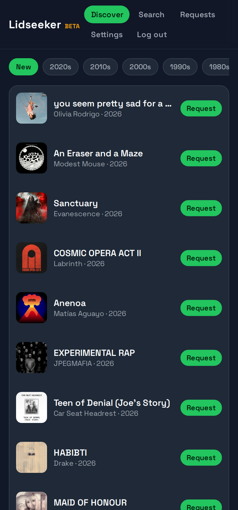
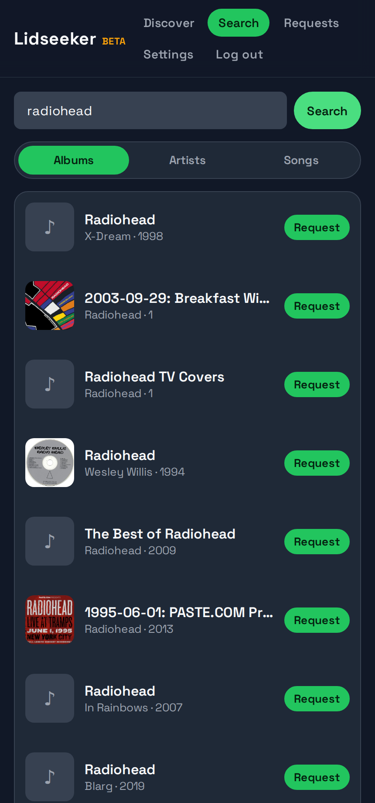
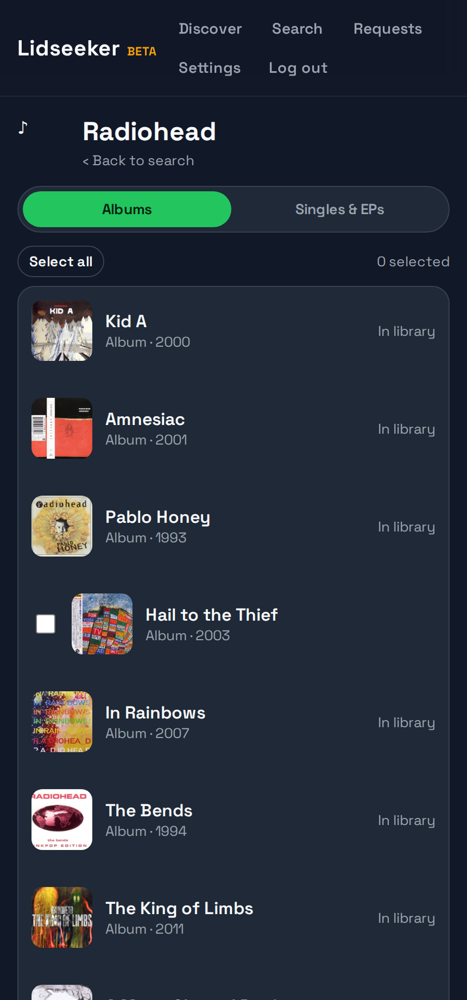
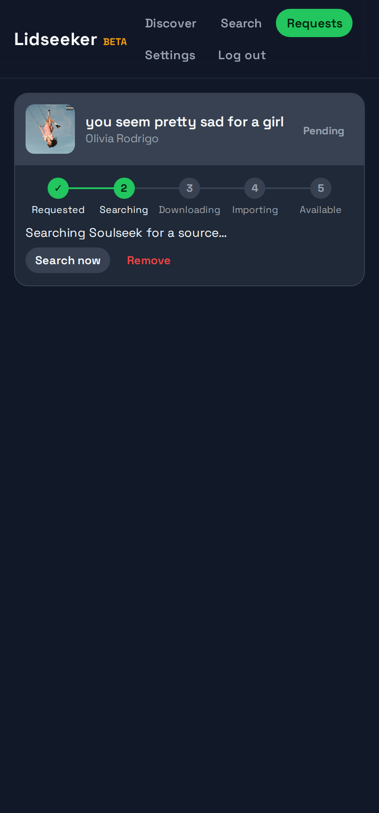
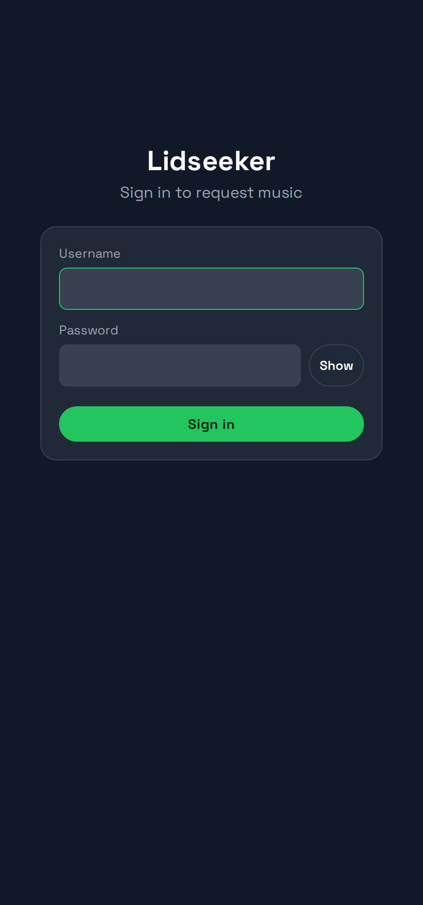
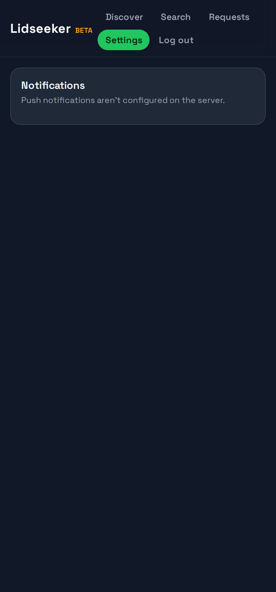

<h1 align="center">Lidseeker</h1>

<p align="center">
  A self-hosted <b>music request &amp; discovery app for <a href="https://lidarr.audio/">Lidarr</a></b> — the "seerr" for music.<br/>
  Search, tap <b>Request</b>, and watch it go from search → download → import → available, with push notifications when it's ready.
</p>

<p align="center">
  
  <a href="LICENSE"></a>
  <a href="https://github.com/IvoryCobra-VC/lidseeker/actions/workflows/docker-publish.yml"></a>
  <a href="https://github.com/IvoryCobra-VC/lidseeker/pkgs/container/lidseeker"></a>
</p>

---

> [!WARNING]
> **Lidseeker is in beta.** It works and is in daily use, but it's early software — expect rough edges
> and the occasional breaking change. There are no logo yet. Back up the `/data` volume, and please
> [open an issue](https://github.com/IvoryCobra-VC/lidseeker/issues) for anything you hit. Feedback
> welcome!

Lidseeker has:

- **Backend + Web UI** — a FastAPI service that sits in front of Lidarr **and serves a built-in web app**,
  all in one Docker image. Just open it in a browser. It handles login, search, request orchestration, and
  live status; your Lidarr API key never leaves the server.
- **Android app** *(optional)* — a Kotlin / Jetpack Compose client. The server URL is entered at runtime,
  so one build works against any backend.

```
┌──────────┐
│ Browser  │ ─┐
└──────────┘  │   ┌─────────────┐      ┌────────┐      ┌──────────────────────┐
              ├─► │  Lidseeker  │ ───► │ Lidarr │ ───► │   download client     │
┌──────────┐  │   │   backend   │ HTTP │        │      │ (SABnzbd/qBit/slskd…) │
│ Android  │ ─┘   │  + web UI   │      └────────┘      └──────────────────────┘
└──────────┘      └─────────────┘
```

## Screenshots

<p align="center">
  
  
  
  
</p>

<details>
<summary>More screenshots</summary>

<p align="center">
  
  
</p>
</details>

## Quick start

**Prerequisites:** Docker, and a running **Lidarr** instance with an API key and at least one
**download client** configured (any of SABnzbd, qBittorrent, NZBGet, Deluge, Transmission, …).

Create a `docker-compose.yml`:

```yaml
services:
  lidseeker:
    image: ghcr.io/ivorycobra-vc/lidseeker:latest
    container_name: lidseeker
    restart: unless-stopped
    network_mode: host                 # so it can reach Lidarr at localhost:8686
    user: "1000:1000"                  # uid:gid that owns ./lidseeker/data
    environment:
      - TZ=Etc/UTC
      - PORT=5056
      # --- Lidarr ---
      - LIDARR_URL=http://localhost:8686
      - LIDARR_API_KEY=your-lidarr-api-key
      # --- Login (single user) ---
      - APP_USER=admin
      - APP_PASSWORD=change-me                       # plaintext, hashed at startup
      - JWT_SECRET=change-me-to-a-long-random-string # any long random string
    volumes:
      - ./lidseeker/data:/data         # SQLite request store
    healthcheck:
      test: ["CMD", "python", "-c", "import urllib.request; urllib.request.urlopen('http://localhost:5056/api/health')"]
      interval: 1m
      timeout: 5s
      retries: 3
```

Then:

```bash
docker compose up -d
curl localhost:5056/api/health      # {"status":"ok"}
```

Then open **`http://<host>:5056`** in a browser and sign in with your `APP_USER` / `APP_PASSWORD` — the
web UI is built into the backend, nothing else to deploy.

The image is multi-arch (amd64 + arm64), so it runs on x86 servers and ARM boxes (e.g. a Raspberry Pi)
alike.

### Exposing it safely (HTTPS)

lidseeker speaks plain HTTP and is meant to sit behind a reverse proxy that terminates TLS — don't put
it on the public internet on `:5056` directly. On your LAN, `http://<host>:5056` is fine as-is.

For a public HTTPS URL you have two easy paths:

- **Cloudflare Tunnel / Tailscale** — no ports to open; point the tunnel at `http://<host>:5056`.
- **Bundled Caddy overlay** — automatic Let's Encrypt certificates, one command:

  ```bash
  DOMAIN=lidseeker.example.com \
  docker compose -f docker-compose.yml -f docker-compose.tls.yml up -d
  ```

  (`DOMAIN` must resolve to this host and ports 80 + 443 must be reachable for the ACME challenge.)
  Already run Traefik or nginx? Just proxy it to `http://<host>:5056` instead.

**When exposing it, also:**

- Use a strong `APP_PASSWORD`. The login endpoint is rate-limited (failed attempts per IP), and a
  random `JWT_SECRET` is generated + persisted automatically if you don't set one.
- Set `TRUST_PROXY=true` so the rate-limiter sees real client IPs via `X-Forwarded-For`.
- Set `SECURITY_HSTS=true` once you're always on HTTPS.

The backend ships safe response headers (`X-Content-Type-Options`, `X-Frame-Options`, `Referrer-Policy`);
add a Content-Security-Policy at your proxy if you want one. See [`.env.example`](backend/.env.example)
for all hardening settings.

### Optional: Android app

Prefer a native app? **Download the latest `lidseeker-*.apk` from the
[releases page](https://github.com/IvoryCobra-VC/lidseeker/releases)** and sideload it (enable
"install from unknown sources"). On first launch, enter the backend URL and your `APP_USER` /
`APP_PASSWORD`.

(You can also build it yourself — see [`android/`](android).)

## Recommended stack

| Component | Role | Required |
|---|---|---|
| [Lidarr](https://lidarr.audio/) | Music library manager + metadata | ✅ |
| A Lidarr **download client** (SABnzbd, qBittorrent, NZBGet, …) | Fetches the music | ✅ |
| [slskd](https://github.com/slskd/slskd) + [Soularr](https://github.com/mrusse/soularr) | Optional Soulseek adapter (live transfer progress + quality toggle) | optional |

## Download backends

Lidseeker works with **any** Lidarr download client out of the box — it reads download progress straight
from Lidarr's own queue ("Lidarr-native" mode). There's also an optional **Soularr + slskd (Soulseek)
adapter** that adds live Soulseek transfer progress and a FLAC/MP3 quality toggle; it auto-enables when an
slskd API key + Soularr config are present. Controls that only apply to that adapter are hidden in the app
when it's off.

| Capability | Lidarr-native | Soularr + slskd |
|---|---|---|
| Request → monitor → import → available | ✅ | ✅ |
| Live download progress | ✅ (Lidarr queue) | ✅ (Soulseek transfers, earlier visibility) |
| Give-up after N searches → "Failed" | ✅ | ✅ |
| FLAC/MP3 quality toggle | — | ✅ |
| "Search now" | ✅ (Lidarr AlbumSearch) | ✅ (restart Soularr) |
| Push notifications (ntfy) | ✅ | ✅ |

To enable the adapter, set the `SLSKD_*` / `SOULARR_*` vars and layer the overlay (it adds the Soularr
config mount + a locked-down docker-socket proxy — clone the repo for these files):

```bash
docker compose -f docker-compose.yml -f docker-compose.soularr.yml up -d
```

## Features

- **Built-in web UI** — a full-featured web app (Discover, Search, request pipeline, Settings) served by
  the backend, plus an optional native Android app. Both talk to the same API.
- **Search & request** — artists, albums, and individual songs (MusicBrainz metadata via Lidarr). Tap
  **Request** and Lidseeker adds + monitors it in Lidarr and kicks off a search.
- **Live request pipeline** — every request shows a 5-stage tracker (requested → searching → downloading →
  importing → available) with a progress bar, updated as it moves.
- **Gives up gracefully** — a request that finds no source after a few search cycles is marked **Failed**
  (red) with a one-tap **Retry**, instead of hanging on "pending" forever.
- **Discover** — unowned releases from artists already in your library, browsable by genre and decade.
- **Push notifications** — optional [ntfy](https://ntfy.sh) push the moment an album becomes available
  (works with the app closed).
- **Multi-user** — admin-managed accounts (Settings → Users). Everyone sees only their own
  requests; admins see everyone's, with who requested what. JWT auth; your Lidarr key stays on the
  server.

## Configuration

All settings are environment variables on the backend container.

**Required**

| Variable | Description |
|---|---|
| `LIDARR_URL` | Your Lidarr base URL (e.g. `http://localhost:8686`) |
| `LIDARR_API_KEY` | Lidarr API key (Settings → General) |
| `APP_USER` | Username of the **first admin** (seeded on first start; add more users in-app) |
| `APP_PASSWORD` | First admin's password (plaintext; hashed at startup). *Or* set `APP_PASS_HASH` to a pre-computed bcrypt hash |
| `JWT_SECRET` | Any long random string used to sign sessions |

**Common optional**

| Variable | Default | Description |
|---|---|---|
| `PORT` | `5056` | Port the backend listens on |
| `TZ` | `UTC` | Timezone |
| `ROOT_FOLDER_PATH` | `/music` | Lidarr root folder used when adding artists |
| `QUALITY_PROFILE_ID` | `1` | Lidarr quality profile id |
| `METADATA_PROFILE_ID` | `1` | Lidarr metadata profile id |
| `NTFY_URL`, `NTFY_TOPIC` | – | Enable ntfy push notifications |
| `SERVICE_LINKS` | – | `Name\|url` chips shown under a request, comma-separated |

**Soularr + slskd adapter (optional)**

| Variable | Description |
|---|---|
| `SOULARR_ENABLED` | `auto` (on when `SLSKD_API_KEY` + Soularr config present), or `true`/`false` |
| `SLSKD_URL`, `SLSKD_API_KEY` | slskd connection |
| `SOULARR_CONTAINER`, `DOCKER_PROXY_URL` | Soularr container name + the docker-proxy URL (for "search now") |
| `SOULARR_CONFIG_PATH`, `SOULARR_DENYLIST_PATH` | Paths to Soularr's mounted config + denylist |

See [`backend/.env.example`](backend/.env.example) for the full annotated list, and
[`backend/README.md`](backend/README.md) for the API/endpoints reference (the backend also serves
interactive docs at `/docs`).

## Volumes

| Path | Purpose |
|---|---|
| `/data` | SQLite request store (`lidseeker.db`) — persist it to keep request history |

## Building from source

The image is published automatically to GHCR, but you can build it yourself:

```bash
git clone https://github.com/IvoryCobra-VC/lidseeker
cd lidseeker/backend
docker compose -f docker-compose.yml -f docker-compose.build.yml up -d --build
```

The Android app builds with `./gradlew assembleDebug` (Android SDK + JDK 17).

## Changelog

Full history and downloads on the [releases page](https://github.com/IvoryCobra-VC/lidseeker/releases).

### v0.3.0-beta
- **Multi-user accounts** (admin-managed) — add users in Settings → Users; requests are attributed
  per person; non-admins see only their own, admins see all. `APP_USER`/`APP_PASSWORD` now seed the
  first admin (existing single-user installs upgrade seamlessly). Web UI only this round; the Android
  app still works against any account (in-app user management is a follow-up).

### v0.2.0-beta
- **Built-in web UI** (React/Vite) served by the backend at `/` — full parity with the app (Discover,
  Search, artist detail, request pipeline with retry/remove, Settings). No extra container.

### v0.1.1-beta
- Backend image now published at `ghcr.io/ivorycobra-vc/lidseeker` (updated registry namespace).
- `MUSICBRAINZ_CONTACT` now defaults to the project repo (correct MusicBrainz User-Agent out of the box).
- README/docs polish.

### v0.1.0-beta
- First public beta.
- Search & request (artists / albums / songs), live 5-stage request pipeline, give-up → **Failed** with retry.
- Discover unowned releases by genre/decade; optional ntfy push notifications.
- Works with any Lidarr download client; optional Soularr + slskd (Soulseek) adapter.
- Prebuilt multi-arch (amd64 + arm64) Docker image + sideloadable Android APK.

## License

[MIT](LICENSE). Lidseeker is an independent project. It integrates with Lidarr, and optionally with
Soularr and slskd, **only over their HTTP APIs** (and, for the optional Soularr adapter, by reading/writing
Soularr's own config files) — it contains no code from those projects, which are separately licensed.
